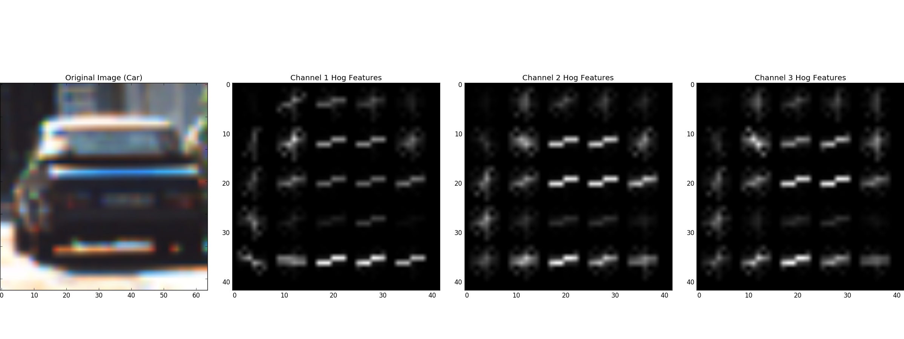
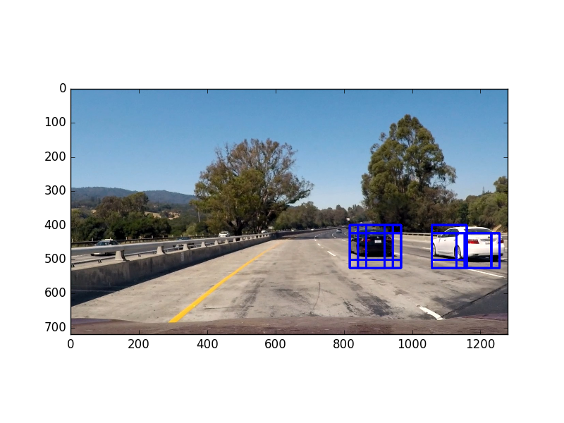
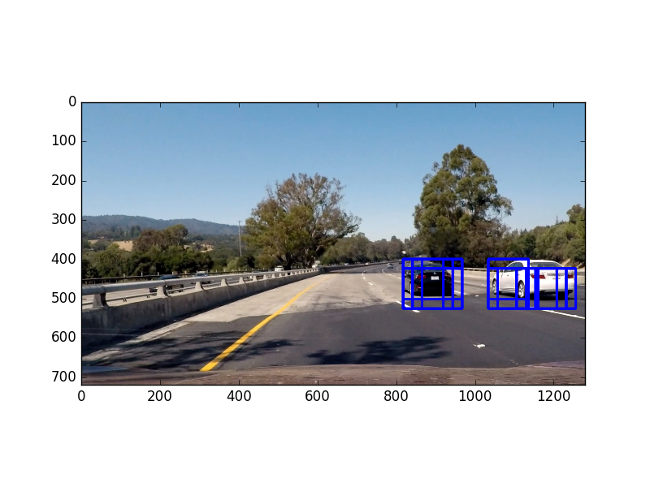
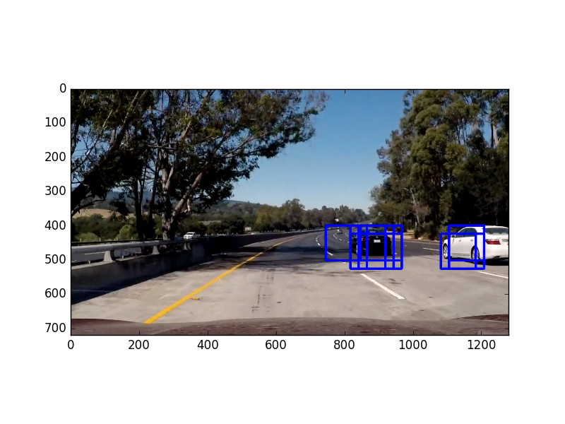
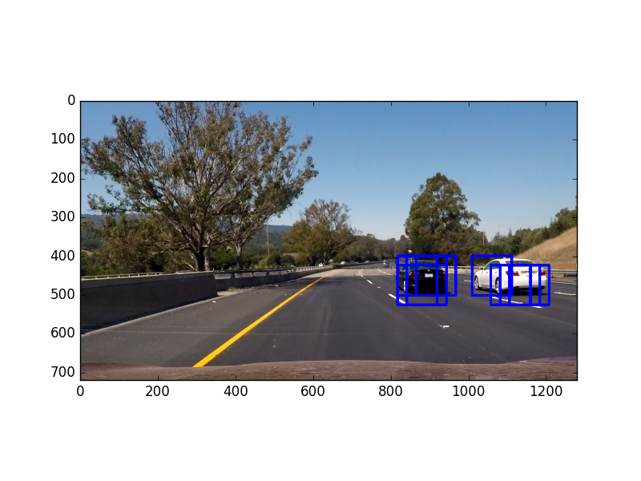
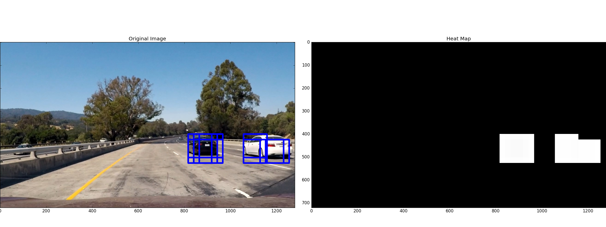
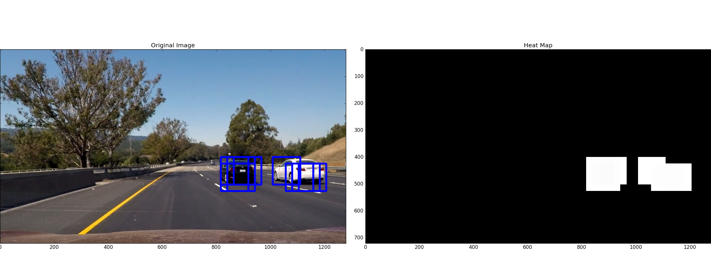
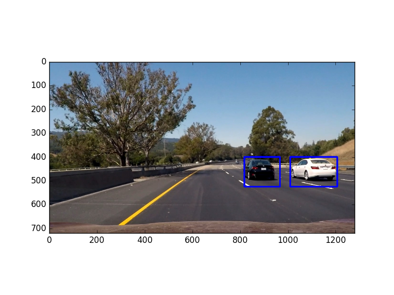

##Writeup

---

**Vehicle Detection Project**

The goals / steps of this project are the following:

* Perform a Histogram of Oriented Gradients (HOG) feature extraction on a labeled training set of images and train a classifier Linear SVM classifier
* Optionally, you can also apply a color transform and append binned color features, as well as histograms of color, to your HOG feature vector. 
* Note: for those first two steps don't forget to normalize your features and randomize a selection for training and testing.
* Implement a sliding-window technique and use your trained classifier to search for vehicles in images.
* Run your pipeline on a video stream (start with the test_video.mp4 and later implement on full project_video.mp4) and create a heat map of recurring detections frame by frame to reject outliers and follow detected vehicles.
* Estimate a bounding box for vehicles detected.

## [Rubric](https://review.udacity.com/#!/rubrics/513/view) Points
###Here I will consider the rubric points individually and describe how I addressed each point in my implementation.  

---
###Writeup / README

####1. Provide a Writeup / README that includes all the rubric points and how you addressed each one.  You can submit your writeup as markdown or pdf.  [Here](https://github.com/udacity/CarND-Vehicle-Detection/blob/master/writeup_template.md) is a template writeup for this project you can use as a guide and a starting point.  

You're reading it!

###Histogram of Oriented Gradients (HOG)

####1. Explain how (and identify where in your code) you extracted HOG features from the training images.

This can be found in `library.py` on line 91 in `get_hog_features()`. The method from skimage was used with defined parameters. The way I chose these parameters is explained below. Hog features were extracted from both cars and non-cars, as below.

I decided on extracting the features from all of the color channels because, as you can see below, some features can appear slightly different from channel to channel. Using all channels enabled me to have a more robust model.

####2. Explain how you settled on your final choice of HOG parameters.

In order to determine the correct HOG parameters I went through a lot of trial and error. It has been stated that an orientation of 9 is optimal for anything higher does not produce better results. I trusted that and it worked for me. I chose 8 pixels per cell because that was about the size of the features I needed to extract. I decided to use all channels so that I would have the most color information possible. At first, the model was having a hard time distinguising white cars. After changing the color space to YCrCb and using all of the channels it was able to pick out the white car a little better but it was still poor. As for the binning dimensions and number of bins I wrote a function which iterated through each value and I manually viewed each result to see what was the best value.

####3. Describe how (and identify where in your code) you trained a classifier using your selected HOG features (and color features if you used them).

I used an SVM with probability set to true. This can be found in `train_classifier.py`. I chose to use probabilities because this provided more features being detected though it took considerably more time than using a simple linear SVM. First the features were extracted using the function `extract_features()` found in `library.py`. Then, I shuffled the data to ensure I wasn't overfitting on similar images. A seperate "y" vector was then created out of ones and zeros corresponding to the feature data. Then the data was split into training data and testing data. After the model was fit I saved it to `model.p`. I ended up supplementing the data with images from the video feed, specifically of the white car.

###Sliding Window Search

####1. Describe how (and identify where in your code) you implemented a sliding window search.  How did you decide what scales to search and how much to overlap windows?

The code for the sliding window search can be found in `find_cars()` in `library.py`. The HOG features were extracted once for the entire lower half of each frame of video and the resulting array was then subsampled for each sliding window. The actual sliding process can be found starting on line 41 with the for loop. It just steps through the X and Y axes and moves by `cells_per_step` extracting the features along the way.

####2. Show some examples of test images to demonstrate how your pipeline is working.  What did you do to optimize the performance of your classifier?

As stated before I ended up using probability estimates which gave more accurate detections (more boxes). Features were extracted using a YCrCB 3-channel HOG feature extraction plus spatially binned color and histograms of color in the feature vector. Below are some example results.

### Video Implementation

####1. Provide a link to your final video output.  Your pipeline should perform reasonably well on the entire project video (somewhat wobbly or unstable bounding boxes are ok as long as you are identifying the vehicles most of the time with minimal false positives.)
Here's a [link to my video result](./output.mp4)

####2. Describe how (and identify where in your code) you implemented some kind of filter for false positives and some method for combining overlapping bounding boxes.

A heat map was used to filter out false positives, though the classifier and feature extraction did so well that there were very little, if any, false positives. Thus I did not use a threshold and a heat map might not even be necessary. In any case, the heat map was translated from the number of frames in each image of the video sequence. The frames were store in an array `detected` to be used in `add_heat()`.  

Here's an example of the heat map on a test image. This converts all of the detection frames into a general area of fit.

### Here the resulting bounding boxes are drawn onto the test image:

---

###Discussion

####1. Briefly discuss any problems / issues you faced in your implementation of this project.  Where will your pipeline likely fail?  What could you do to make it more robust?

The issues I faced in this project were definitely eliminating the false positives. I was able to bring them down to practially zero (I did not see a FP once) because I tuned in my feature extraction method so well. I was still having issues identifying the white car. This was solved by supplementing the data with images from the image feed. I made sure to add these images to the training data after the train/test split to ensure they would have an effect on the model parameters. I think because of this fault I experience, the model will have a hard time identifying other "new" cars that are anomolous to the training set. To solve this I would just use a bigger, more varied training set and rigorously test it. 
